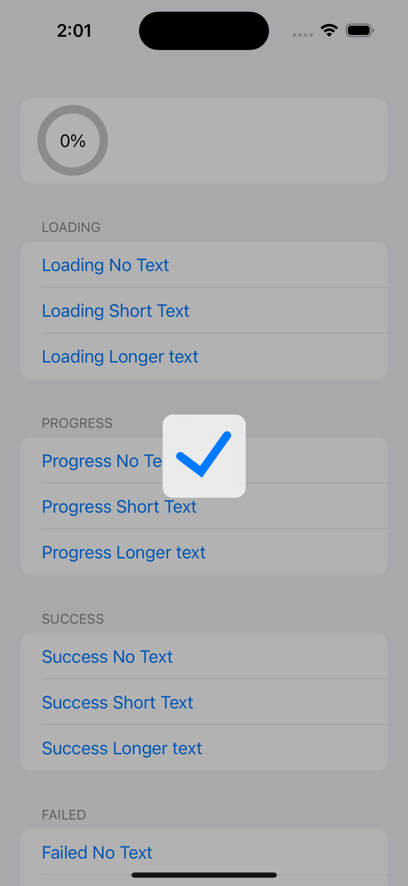

[](https://swift.org/package-manager/)


HUD是基于SwiftUI开发的Loading弹窗工具，样式参考[ProgressHUD](https://github.com/relatedcode/ProgressHUD) 。

目前功能有 Loading，Progress，Success，Failed

|  |  |  |
| ------------------------------------------------------------ | ------------------------------------------------------------ | ------------------------------------------------------------ |
|  |  |                                                              |


## 功能

在适当位置添加可观察的管理器

```Swift
@StateObject private var context = LoadingManager()
```

如果是页面传递请

```Swift
ContentView()
            .environmentObject(context) 
//然后内部页面
@EnvironmentObject private var context: LoadingManager
```

在需要使用Loading的页面添加

```swift
.addLoading(context)
```

剩下的只需要在触发位置

```swift
                Button {
                    context.text = "Please wait..."
                    context.showLoading()
                } label: {
                    Text("Loading Short Text")
                }
```

 或者根据状态控制

```swift
        .onChange(of: revenueCat.isPurchasing) { newValue in
            if newValue{
                loading.showLoading()
            }else{
                loading.dismiss()
            }
        }
```

关闭HUD

```
context.dismiss()
```

内置的其他HUD

```swift
context.showLoading()
context.showProgress()
context.showSuccess()
context.showFailed()
```


## 安装

### cocoapods

1.在 Podfile 中添加 `pod ‘SwiftUIHUD’`

2.执行 `pod install 或 pod update`

3.导入 `import SwiftUIHUD`

### Swift Package Manager

从 Xcode 11 开始，集成了 Swift Package Manager，使用起来非常方便。HUD 也支持通过 Swift Package Manager 集成。

在 Xcode 的菜单栏中选择 `File > Swift Packages > Add Pacakage Dependency`，然后在搜索栏输入

`https://github.com/jackiehu/HUD`，即可完成集成

### 手动集成

HUD 也支持手动集成，只需把Sources文件夹中的HUD文件夹拖进需要集成的项目即可


具体使用代码api以及详细效果参见Demo


## 更多砖块工具加速APP开发

[](https://github.com/jackiehu/SwiftMediator)

[](https://github.com/jackiehu/SwiftShow)

[](https://github.com/jackiehu/SwiftLog)

[](https://github.com/jackiehu/SwiftyForm)

[](https://github.com/jackiehu/SwiftEmptyData)

[](https://github.com/jackiehu/SwiftPageView)

[](https://github.com/jackiehu/JHTabBarController)

[](https://github.com/jackiehu/SwiftMesh)

[](https://github.com/jackiehu/SwiftNotification)

[](https://github.com/jackiehu/SwiftNetSwitch)

[](https://github.com/jackiehu/SwiftButton)

[](https://github.com/jackiehu/SwiftDatePicker)

