[](https://swift.org/package-manager/)


此Package与[Gitee](https://gitee.com/zjinhu/hud)同步，如果觉得SPM引入github地址偏慢可以使用Gitee。

HUD是基于SwiftUI开发的Loading弹窗工具，样式参考[ProgressHUD](https://github.com/relatedcode/ProgressHUD)  和  [PopupView](https://github.com/Mijick/PopupView)。

目前功能有 Loading，Progress，Success，Fail，PopupView，支持继承协议自定义样式以及弹出动画。

支持暗色模式

| 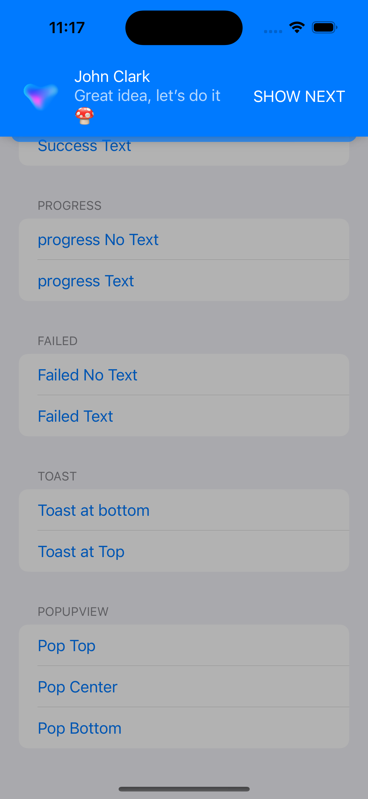     | 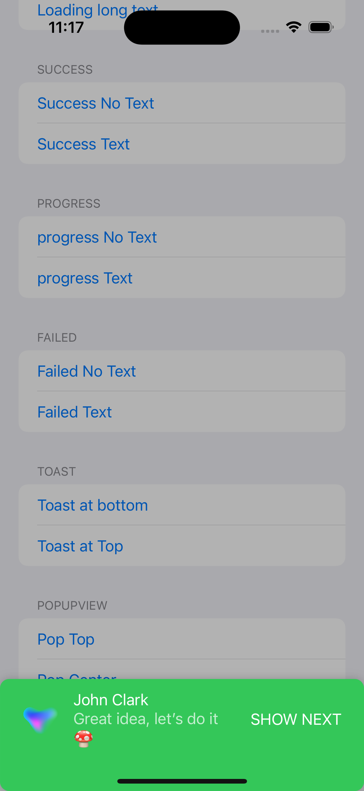   | 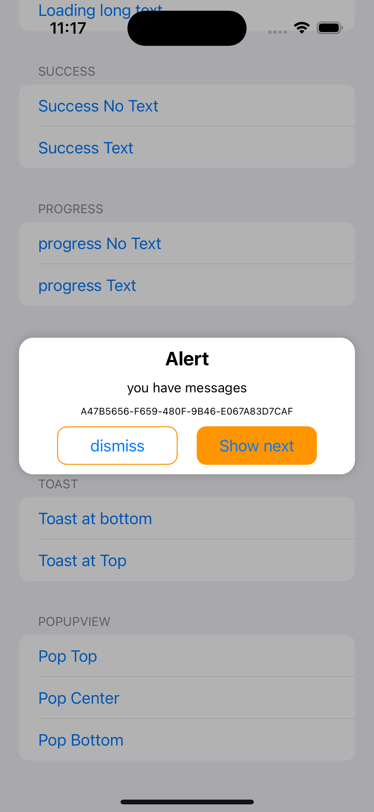   |                         |                          |
| ---------------------- | ----------------------- | ----------------------- | ----------------------- | ------------------------ |
| 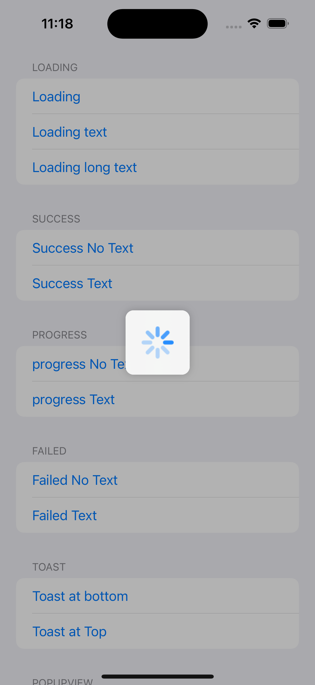 |  | 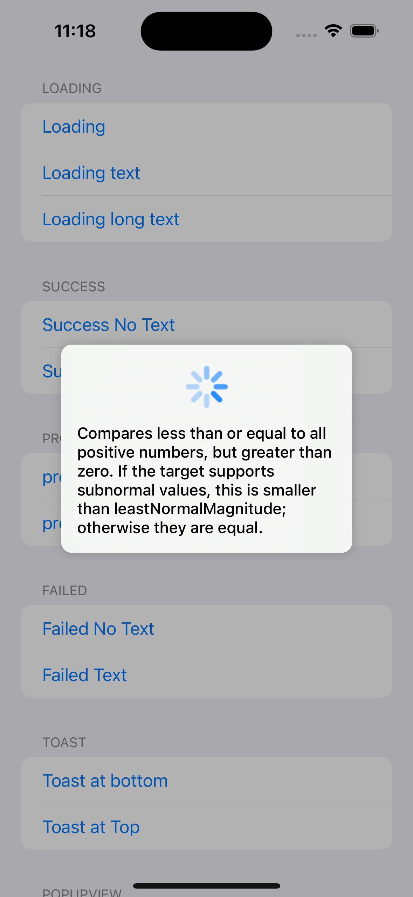 | 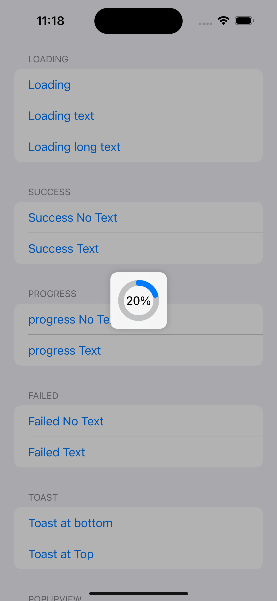 | 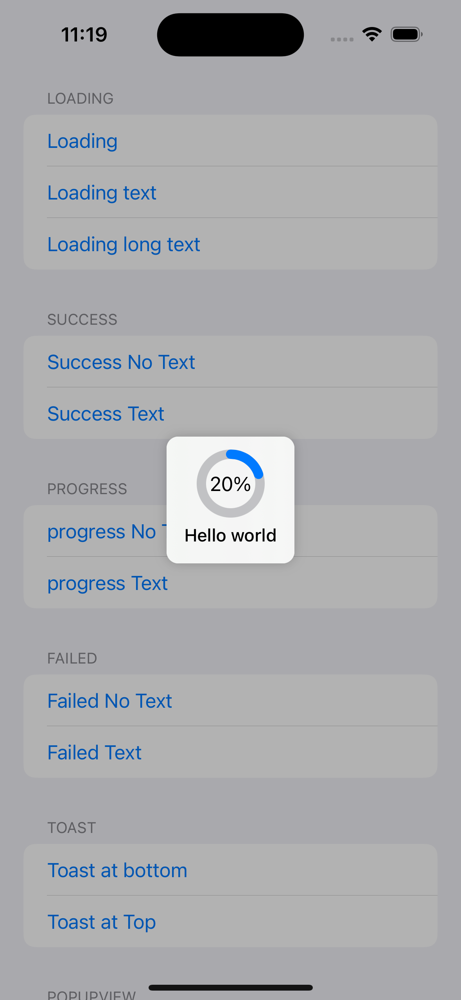 |
| 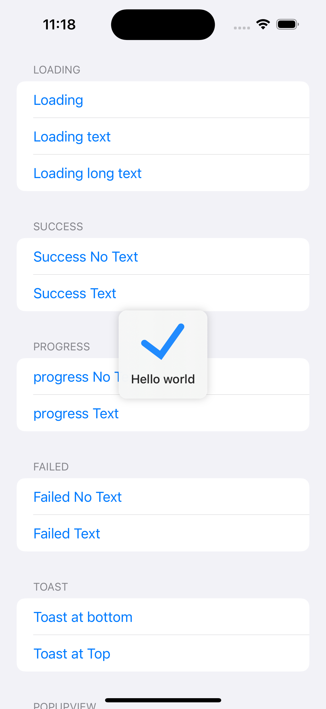    | 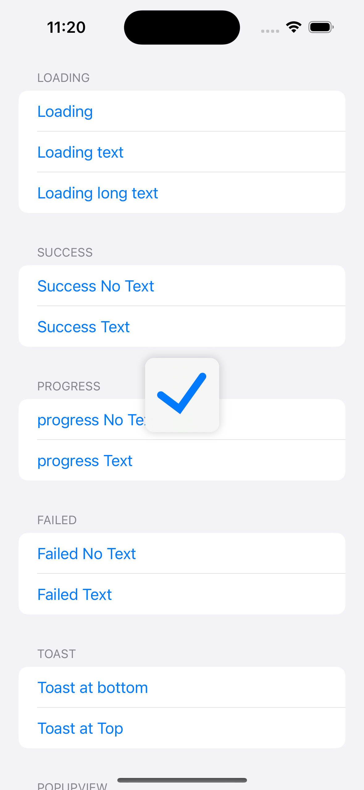    | 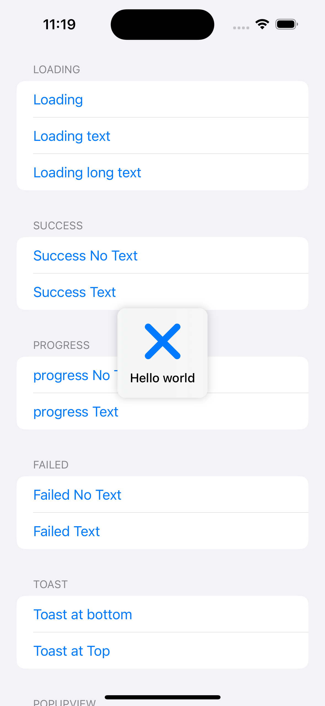     | 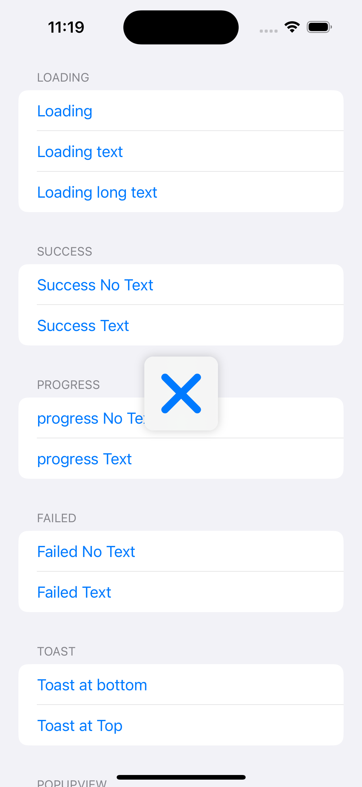    |                          |


## 功能

在需要使用Loading或弹窗的的页面添加（仅遮盖当前页面，如果需要遮盖TabView或者NavigationView请直接添加在根View上，比如ContentView()）

```Swift
.addHUD()
```
各种内置弹窗

```swift
    //声明弹窗
    @State var loading = LoadingView(text: .constant(nil))

    @State var loadingText = LoadingView(text: .constant("loading...")）

    @State var fail = FailView(text: .constant(nil))
    @State var succ = SuccessView(text: .constant(""))

```

Text和Progress需要绑定外部参数，所以可以这样用

```swift
    @State var progress: CGFloat = 0
    @State var progressView: StepView?

    @State var loadingText: String?
    @State var loading: LoadingView?

    //在适当的位置绑定
    .onAppear {
        progressView = StepView(progress: $progress)
        loading = LoadingView(text: $loadingText)
    }
    //修改当前progress或loadingText然后就可以自动变化了

```

剩下的只需要在触发位置

```swift
   Button {
       loading.showHUD()
   } label: {
       Text("Loading Short Text")
   }
```

 或者根据状态控制

```swift
  .onChange(of: revenueCat.isPurchasing) { newValue in
       if newValue{
            loading.showHUD()
       }else{
            loading.dismissHUD()
       }
   }
```

关闭HUD

```
.dismissHUD()
```

适配器内有超多自定义功能

```Swift
    //是否需要遮罩
    var needMask: Bool = true
    //弹窗背景颜色
    var backgroundColour: Color = .clear
    //弹窗忽略安全区域
    var ignoresSafeArea: Bool = false
    //点击区域外关闭弹窗
    var touchOutsideToDismiss: Bool = false
    //圆角弧度
    var cornerRadius: CGFloat = 10
    //手势关闭
    var dragGestureProgressToClose: CGFloat = 1/3
    //手势关闭动画
    var dragGestureAnimation: Animation = .interactiveSpring()
    
    //弹窗背景阴影颜色
    var shadowColour: Color = .black.opacity(0.2)
    var shadowRadius: CGFloat = 5
    var shadowOffsetX: CGFloat = 0
    var shadowOffsetY: CGFloat = 0
    
    //距离顶部的padding,默认为0,Top Popup会用到
    var topPadding: CGFloat = 0
    //距离底部的padding,默认为0,Bottom Popup会用到
    var bottomPadding: CGFloat = 0
    //Bottom PopupView自动添加安全区域高度
    var bottomAutoHeight: Bool = false
    
    
    //横向的padding,默认为0,大部分情况Center Popup会用到
    var horizontalPadding: CGFloat = 0
    //中间弹出动画执行时间
    var centerAnimationTime: CGFloat = 0.1
    //Center PopupView弹出动画比例
    var centerTransitionExitScale: CGFloat = 0.86
    //Center PopupView弹出动画比例
    var centerTransitionEntryScale: CGFloat = 1.1
    
    
    //弹出动画
    var transitionAnimation: Animation = .spring(response: 0.32, dampingFraction: 1, blendDuration: 0.32)

    //堆栈样式--露出位置--默认6
    var stackViewsOffset: CGFloat = 6
    //堆栈样式--比例
    var stackViewsScale: CGFloat = 0.06
    //堆栈样式--圆角
    var stackViewsCornerRadius: CGFloat = 10
    //堆栈样式--最大堆展示数量
    var maxStackCount: Int = 3
    
    
    //是否需要自动关闭
    var autoDismiss: Bool = false
    //自动关闭等候时长
    var autoDismissDuration: TimeInterval = 3
```


具体使用代码api以及详细效果参见Demo


## 安装

### Swift Package Manager

从 Xcode 11 开始，集成了 Swift Package Manager，使用起来非常方便。HUD 也支持通过 Swift Package Manager 集成。

在 Xcode 的菜单栏中选择 `File > Swift Packages > Add Pacakage Dependency`，然后在搜索栏输入

`https://github.com/jackiehu/HUD`，即可完成集成

### 手动集成

HUD 也支持手动集成，只需把Sources文件夹中的HUD文件夹拖进需要集成的项目即可


## 更多砖块工具加速APP开发

[](https://github.com/jackiehu/SwiftMediator)

[](https://github.com/jackiehu/SwiftShow)

[](https://github.com/jackiehu/SwiftLog)

[](https://github.com/jackiehu/SwiftyForm)

[](https://github.com/jackiehu/SwiftEmptyData)

[](https://github.com/jackiehu/SwiftPageView)

[](https://github.com/jackiehu/JHTabBarController)

[](https://github.com/jackiehu/SwiftMesh)

[](https://github.com/jackiehu/SwiftNotification)

[](https://github.com/jackiehu/SwiftNetSwitch)

[](https://github.com/jackiehu/SwiftButton)

[](https://github.com/jackiehu/SwiftDatePicker)

